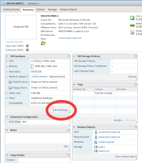
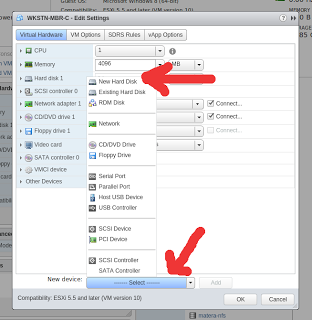
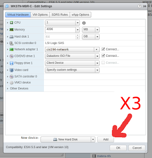
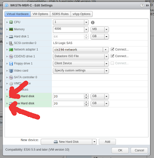
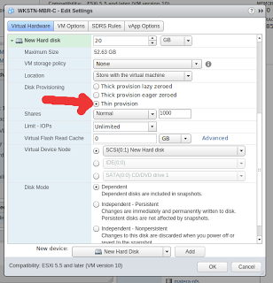
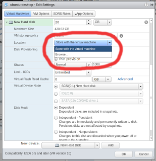
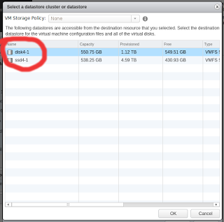

This article guides you through the process of adding three disks to your VM. You'll use those disks in labs and homework.

## Procedure 

You must use the web client to add disks, the RDP client will not let you edit your VM settings. From the web's home screen select:

```
vCenter -> VMs and Templates -> CIS 191 -> Your folder
```

Add two 20 GB disks that arethin provisioned. You must use thin provisioning because there's not enough disk space.
1. Shutdown your VM2. Edit your VM Settings.




3. Click the New Hardware pulldown and select New Hard Disk.




4. Click the Add button three times.




5. Change the disk size to 20GB then expand the properties ofall threedisks




6. For both disks select "Thin Provision"




7. For both disks change the location by selecting "Browse" and once in browse select "disk4-1" (You will get an error if you try to use ssd4-1).







8.Double check that you have selected Thin Provision for both and start your VM.
