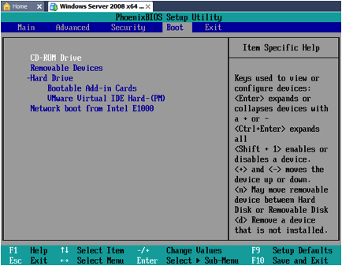

Lecture slides are [here](https://docs.google.com/a/lifealgorithmic.com/presentation/d/1yNwFcDZsK2ceIGk65YXr6fCz0-P81kP5TvYnSrCtXCM/edit?usp=sharing).

## The Linux Boot Sequence 

There are two forms of memory in all computers, volatile and non-volatile. Volatile memory is fast but it cannot hold information without a supply of electricity. Examples of volatile memory are SRAM (the kind that's used in the processor cache) and DRAM which is what most computers use as main memory. Non-volatile memory is slower than volatile memory but has the advantage of being able to retain its contents with the power off. Examples of non-volatile memory are Flash (used on USB thumb drives and SSDs) and old fashioned magnetic hard disk drives. On x86 machines Linux can only execute from volatile memory (like DRAM) so when power is first applied the kernel is moved from disk into DRAM. The process of taking Linux from non-volatile storage, loading it into volatile storage is called booting. It's a very convoluted process that has to be done carefully. It's easy to overlook how much work it is to get a computer ready to go because it usually doesn't take very long.

### Step 0: Getting Hardware Ready 

When you power on a computer the CPU wakes up into a lonely world. Most of the hardware that surrounds it is not ready to use. It's the job of the processor to wake up all the rest of the hardware on the machine, including the RAM. That's where the BIOS comes it. The BIOS is a program stored on Flash chips on the motherboard. The BIOS is the first program that executes. It's authors customized it to exactly match the hardware on the motherboard. That's important because there can be tremendous variation in hardware. When the machine is initialized the BIOS will search for a place to get more instructions.

### Legacy, EFI and UEFI 

In the PC world there are three kinds of BIOS that you may encounter. For decades the PC BIOS was the standard. Really, it was a total mess with no standard and a lot of historical baggage. The limitations of the PC BIOS eventually became a roadblock for innovation and Intel proposed a replacement called Extensible Firmware Interface (EFI). The world learned a lot from EFI but it also had some problems that limited its usefulness so a consortium of companies got together and created the [Unified Extensible Firmware Interface (UEFI)](http://en.wikipedia.org/wiki/Unified_Extensible_Firmware_Interface) which is now standard on all new PCs. UEFI has an important feature called secure boot. This feature can make it difficult to boot Linux on a computer that has Windows. Should you find yourself having trouble getting Linux to boot, see [Ubuntu's documentation](https://help.ubuntu.com/community/UEFI).
 
### Configuring BIOS 

How you configure BIOS depends on the make and model of your computer. New computers usually have menu driven systems where you can use the mouse. VMWare mimics the old-style text only menu systems that have been common for decades. On recent computers there will be many, many options to configure. The most important one is where to look for the boot loader. This screen in VMWare lets you select:





Bootloaders can also be loaded over the Internet. This configuration is common in environments with a large number of computers because it's a pain to update disks. We won't cover that in class but if you want a project that will take you all weekend you can make your VM boot over the network.
 
## Step 1: Load the Bootloader 

BIOS can only load simple programs into RAM. Complicated programs like Linux must have everything setup very specifically in order to run and BIOS is not capable of doing that. A program that can be loaded by BIOS and is capable of loading Linux (or another OS) is called a Boot Loader. On the PC platform Linux uses a boot loader called [GRUB](http://www.gnu.org/software/grub/), on ARM platforms (e.g. BeagleBone and Android) Linux uses [Das U-Boot](http://www.denx.de/wiki/U_Boot). These programs are simple, but extremely flexible. Both GRUB and U-Boot have a command line that allows users to manipulate the boot process by selecting where to find Linux (perhaps from the network). U-Boot may give a user the option to write a new copy of Linux into non-volatile memory.
 
### Configuring GRUB 

 In depth:[GRUB](grub)
In this section I'm going to discuss only a few of the things you can do with GRUB. For the full picture look at [Ubuntu's documentation](https://help.ubuntu.com/community/Grub2). There are a few key locations where you will find GRUB's configuration:

```
/boot/grub/grub.cfg
```

This is GRUB's configuration file, the one that is actually used to boot the machine. It is automatically generated so you should never edit it directly or your edits will be lost.The other locations control the generation of 
```
grub.cfg
```

.Basic settings for GRUB like how long it shows the menu before booting and what image to use for the splash screen can be found in:

```
/etc/default/grub
```

If you want to change something about GRUB try to do it in 
```
/etc/default/grub
```

 first. This is the easiest place.Files in here get added to 
```
/etc/default/grub
```

:

```
/etc/default/grub.d/
```

This location is used by packages to add stuff to GRUB without messing up your configuration. You won't need to touch anything here.This directory contains the shell scripts that generate 
```
/boot/grub/grub.cfg
```

:

```
/etc/grub.d/
```

The shell scripts automatically determine what operating systems are loaded onto your machine and generate GRUB menu entries for them. You can do anything you want with GRUB by adding your own scripts or changing the order in which the existing scripts run.When you have changed GRUBs configuration in 
```
/etc/default
```

 or 
```
/etc/grub
```

 the changes are not automatically reflected in 
```
grub.cfg
```

. In order to save your changes you must run the following command:

```
$ sudo update-grub

```

Check the output for errors. If you try to reboot the machine with a bogus 
```
grub.cfg
```

 you will be sorry!

## Step 2: Loading Linux 

Watch this video of two distributions of Linux booting:

### Multiprocessor Boot Advantage 

How long did it take to load Linux on Ubuntu and on CentOS? The answer is that they both took about the same time. Linux itself is a very small program and as soon as you see any text on the screen it is already loaded and fully functional. But that doesn't mean that the computer is ready to do real work. In order for that to happen many other programs must be loaded (e.g. X-Windows or the login program). The job taking the system from the point where Linux is loaded to the point where it's ready for users is the job of the init program. Init is always the program with PID 1. Where does init come from? That is a two part answer.

### Early Initialization: The Initial RAM Disk (initramfs) 

Linux needs a root filesystem in order to run (we'll talk about filesystems later in the class). When GRUB loads Linux it may not have the necessary drivers to access its root filesystem. This may seem a bit odd but remember Linux runs on very exotic hardware. On a server machine the root filesystem may be accessed using rare and expensive hardware. It's impractical to compile Linux with every driver it could ever need just so it can boot on those systems. Instead Linux first boots onto a special disk called the initial RAM disk (sometimes called initrd or initramfs). This RAM disk contains a very simple filesystem that happens to be loaded with drivers that Linux might need. This simple filesystem can also be used for recovery in the case of an emergency.

## Class Exercise: Look at the contents of your initramfs 

You can view the contents of your initramfs by unpacking it into a directory. The initramfs is a compressed cpio file. Cpio is similar to tar, it takes a directory tree can packs it into a single file. Here's how to see what's in your initramfs:

```
mkdir /tmp/initramfs
cd /tmp/initramfs
gunzip -c /initrd.img | cpio -i

```

Now the contents of your initramfs are unpacked into the /tmp/initramfs directory. What kernel drivers are in your initramfs?

### Final Initialization: The Root Filesystem 

Once the init program on the initramfs identifies and mounts the root filesystem it replaces itself with the init program located there. After doing the class lab look at the program located in /tmp/initramfs/init. That program is a shell script. The init program on a fully booted Ubuntu system is /sbin/init. /sbin/init is a program called upstart. Upstart is responsible for loading the programs and daemons that make Linux fully functional.

## Step 3: System Initialization 

 As you saw in the initramfs the init program is a shell script. For most of the history of Unix the init program was a shell script. The script ran other scripts found in /etc/init.d. They are called the System-V (pronounced system five) init scripts. The System-V boot process was easy to control if you knew BASH programming but has some technical limitations. It is not able to take advantage of multiple processors on a system so boot times got longer even as hardware got faster (see the video above). The [upstart program](http://upstart.ubuntu.com/) was developed to replace the System-V boot process. Upstart was used on Ubuntu in 16.04 it was [replaced](http://www.zdnet.com/after-linux-civil-war-ubuntu-to-adopt-systemd-7000026373/)by [systemd](https://www.freedesktop.org/wiki/Software/systemd/).

Systemd's job is to setup the system by starting a bunch of programs, enabling networking and setting up devices. In sytemd jargon a thing that it manages is called a unit. Systemd is controlled using the command systemctl. This section shows you the most common systemctl commands and describes what they do.
To see what units are managed by systemd run systemctl without any arguments:

```
$ systemctl
 UNIT                                  LOAD  ACTIVE SUB    DESCRIPTION
 proc-sys-fs-binfmt_misc.automount                    loaded active waiting  Arbitrary Executable File Formats File System Automount Point
 sys-devices-pci0000:00-0000:00:10.0-host32-target32:0:0-32:0:0:0-block-sda-sda1.device loaded active plugged  Virtual_disk 1
 sys-devices-pci0000:00-0000:00:10.0-host32-target32:0:0-32:0:0:0-block-sda-sda2.device loaded active plugged  Virtual_disk 2
 sys-devices-pci0000:00-0000:00:10.0-host32-target32:0:0-32:0:0:0-block-sda-sda5.device loaded active plugged  Virtual_disk 5

[..snip..]

 remote-fs-pre.target                          loaded active active  Remote File Systems (Pre)
 remote-fs.target                            loaded active active  Remote File Systems
 slices.target                              loaded active active  Slices
 sockets.target                             loaded active active  Sockets
 swap.target                               loaded active active  Swap
 sysinit.target                             loaded active active  System Initialization
 time-sync.target                            loaded active active  System Time Synchronized
 timers.target                              loaded active active  Timers
 apt-daily.timer                             loaded active waiting  Daily apt activities
 snapd.refresh.timer                           loaded active waiting  Timer to automatically refresh installed snaps
 systemd-tmpfiles-clean.timer                      loaded active waiting  Daily Cleanup of Temporary Directories
LOAD  = Reflects whether the unit definition was properly loaded.
ACTIVE = The high-level unit activation state, i.e. generalization of SUB.
SUB  = The low-level unit activation state, values depend on unit type.
183 loaded units listed. Pass --all to see loaded but inactive units, too.
To show all installed unit files use 'systemctl list-unit-files'.
```

The output listing has been shortened for readability. You can see from the bottom of the listing that there are 183 units that were listed. Run the command on your VM to see them all. You can see a more readable output using the following command:

```
$ systemctl status
● cis191-20
  State: degraded
  Jobs: 0 queued
 Failed: 1 units
  Since: Thu 2016-09-15 08:42:06 PDT; 17min ago
 CGroup: /
     ├─init.scope
     │ └─1 /sbin/init
     ├─system.slice
     │ ├─mdadm.service
     │ │ └─3474 /sbin/mdadm --monitor --pid-file /run/mdadm/monitor.pid --daemonise --scan --syslog
     │ ├─dbus.service
     │ │ └─3418 /usr/bin/dbus-daemon --system --address=systemd: --nofork --nopidfile --systemd-activation
     │ ├─cron.service
     │ │ └─3433 /usr/sbin/cron -f
     │ ├─lvm2-lvmetad.service
     │ │ └─1590 /sbin/lvmetad -f
     │ ├─apache2.service
     │ │ ├─3817 /usr/sbin/apache2 -k start
     │ │ ├─3820 /usr/sbin/apache2 -k start
     │ │ └─3821 /usr/sbin/apache2 -k start
     │ ├─iscsid.service
     │ │ ├─3615 /sbin/iscsid
     │ │ └─3616 /sbin/iscsid
     │ ├─accounts-daemon.service
     │ │ └─3437 /usr/lib/accountsservice/accounts-daemon
     │ ├─atd.service
     │ │ └─3410 /usr/sbin/atd -f
     │ ├─systemd-journald.service
     │ │ └─1567 /lib/systemd/systemd-journald
     │ ├─snapd.service
     │ │ └─3447 /usr/lib/snapd/snapd
     │ ├─systemd-timesyncd.service
     │ │ └─2707 /lib/systemd/systemd-timesyncd
     │ ├─ssh.service
     │ │ └─3605 /usr/sbin/sshd -D
     │ ├─systemd-logind.service
     │ │ └─3434 /lib/systemd/systemd-logind
     │ ├─system-getty.slice
     │ │ └─getty@tty1.service
     │ │  └─3667 /sbin/agetty --noclear tty1 linux
     │ ├─systemd-udevd.service
     │ │ └─1615 /lib/systemd/systemd-udevd
     │ ├─polkitd.service
     │ │ └─3483 /usr/lib/policykit-1/polkitd --no-debug
     │ ├─irqbalance.service
     │ │ └─3670 /usr/sbin/irqbalance --pid=/var/run/irqbalance.pid
     │ ├─open-vm-tools.service
     │ │ └─3413 /usr/bin/vmtoolsd
     │ ├─rsyslog.service
     │ │ └─3438 /usr/sbin/rsyslogd -n
     │ ├─lxcfs.service
     │ │ └─3435 /usr/bin/lxcfs /var/lib/lxcfs/
     │ └─acpid.service
     │  └─3431 /usr/sbin/acpid
     └─user.slice
      └─user-1000.slice
       ├─session-1.scope
       │ ├─3689 sshd: student [priv]
       │ ├─3768 sshd: student@pts/0
       │ ├─3769 -bash
       │ ├─3897 systemctl status
       │ └─3898 pager
       └─user@1000.service
        └─init.scope
         ├─3691 /lib/systemd/systemd --user
         └─3693 (sd-pam) 
```

The output of status shows you only the system services that can be started and stopped on the command line. As an administrator you should know how to control system services.

### Starting and Stopping Services 

Services (like sshd) can be started and stopped (and restarted) easily using the following systemd commands.
Check the status of a service:
```
$ systemctl status ssh
● ssh.service - OpenBSD Secure Shell server
 Loaded: loaded (/lib/systemd/system/ssh.service; enabled; vendor preset: enabled)
 Active: active (running) since Thu 2016-09-15 08:42:10 PDT; 22min ago
Main PID: 3605 (sshd)
  Tasks: 1
 Memory: 4.2M
   CPU: 128ms
 CGroup: /system.slice/ssh.service
     └─3605 /usr/sbin/sshd -D
Sep 15 08:42:10 cis191-20 systemd[1]: Starting OpenBSD Secure Shell server...
Sep 15 08:42:10 cis191-20 sshd[3605]: Server listening on 0.0.0.0 port 22.
Sep 15 08:42:10 cis191-20 sshd[3605]: Server listening on :: port 22.
Sep 15 08:42:10 cis191-20 systemd[1]: Started OpenBSD Secure Shell server.
Sep 15 08:42:16 cis191-20 sshd[3689]: Accepted password for student from 2001:470:4862:beef::2 port 38816 ssh2
Sep 15 08:42:16 cis191-20 sshd[3689]: pam_unix(sshd:session): session opened for user student by (uid=0)
```

Stop a service (note: this is safe if you're logged in via SSH, but you won't be able to make a new session):
```
$ sudo systemctl stop ssh
```

Start a service:
```
$ sudo systemctl start ssh
```

Restart a service (do this if you change the service's configuration files):
```
$ sudo systemctl restart ssh
```

The commands above act on a service but don't change what happens at boot time. Therefore, if you turn off SSH with the stop command, it will be re-enabled after a reboot. 

## Controlling System Startup 

Sometimes you want to disable services that are not used on a system without uninstalling the software. This is a somewhat rare but important thing to be able to do. When you want to disable or enable services at boot time you need the commands below:

Disable a service at boot time:
```
$ sudo systemctl disable ssh
Synchronizing state of ssh.service with SysV init with /lib/systemd/systemd-sysv-install...
Executing /lib/systemd/systemd-sysv-install disable ssh
insserv: warning: current start runlevel(s) (empty) of script `ssh' overrides LSB defaults (2 3 4 5).
insserv: warning: current stop runlevel(s) (2 3 4 5) of script `ssh' overrides LSB defaults (empty).
Removed symlink /etc/systemd/system/sshd.service.
```

Enable a service at boot time:
```
$ sudo systemctl enable ssh
Synchronizing state of ssh.service with SysV init with /lib/systemd/systemd-sysv-install...
Executing /lib/systemd/systemd-sysv-install enable ssh
insserv: warning: current start runlevel(s) (empty) of script `ssh' overrides LSB defaults (2 3 4 5).
insserv: warning: current stop runlevel(s) (2 3 4 5) of script `ssh' overrides LSB defaults (empty).
Created symlink from /etc/systemd/system/sshd.service to /lib/systemd/system/ssh.service.
```

The commands in this section don't affect the service if it's running. So if you want to turn off and disable a service you need two commands.