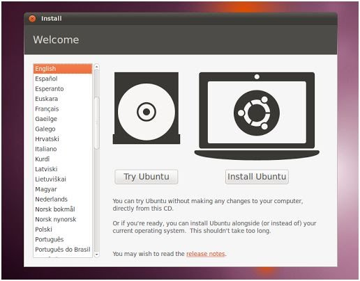
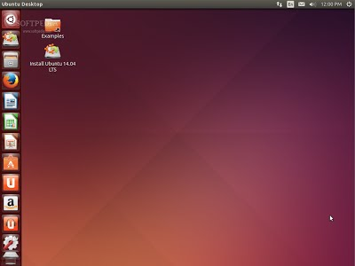

Two ways to destroy Ubuntu. In this lab you will recover from two common disasters that will prevent Ubuntu from booting.

Part 1: Broken GRUB Configuration
Step 1: Break GRUB 
Run the following commands from your terminal prompt. Please be exact:

```
# sudo -s
# eval `wget -q -O - http://opus.cis.cabrillo.edu/cgi-bin/cis191-lab2.cgi` # <-- NOTICE BACKTICKS
```

The backtick is the key to the left of the 1 key.Your machine will reboot but the GRUB configuration has been renamed to a random filename inside of the boot directory. This will prevent Ubuntu from starting.

Step 2: Use GRUBs menu to save your bacon
When you reboot grub cannot proceed. You will be stuck at the menu. 

```
grub> ls  # will show you the disks that GRUB sees. They will be listed in a weird, grubby way

```

Using the ls command find the disk with a /boot directory. 

```
grub> ls (hd0,msdos1)/ 

```

Now we can try to load Linux manually.

```
grub> linux (hd0,msdos1)/vmlinuz-4.4.0-36-generic
grub> initrd (hd0,msdos1)/initrd.img-4.4.0-36-generic
grub> boot

```

Step 3: Getting Linux past initramfs
You did not tell the Linux kernel where to find it's root filesystem. This caused Ubuntu to get stuck in the initial RAM disk (initramfs). From here you have a limited set of commands that you can use to get the system back to a functional state. First you will need to check and mount the root filesystem.

```
(initramfs) mkdir /mnt
(initramfs) mount /dev/sda1 /mnt # It's safe to ignore the warnings
(initramfs) cd /mnt/grub

```

What has grub.cfg been renamed to? Copy GRUB's configuration back to the original name (make sure you save the mangled copy, you will need to turn it in):

```
(initramfs) cp grub.cfg.XXXXXXXXXXXX grub.cfg
(initramfs) reboot

```

You will turn in the file for credit.

Part 2: Deleted GRUB
In this part we'll be deleting GRUB completely and using recovery to reinstall it. This can happen when you install or recover Windows on a dual-boot computer. Windows is not careful to avoid Linux and loves thrashing it. WARNING: Never do this!!!!

Step 1: Insert the Ubuntu Desktop CD
In order to recover your deleted GRUB you will need the Ubuntu Desktop CD. The CD is available in VMWare. Instructions were given in class on how to ensure the CD is properly installed in your VM. The location of the ISO is:

NOTE: This is Ubuntu DESKTOP, not server:

```
[matera-nfs]/ubuntu-14.04.3-desktop-amd64.iso
```

[Here are the VMWare instructions for inserting a CD into your VM.](http://pubs.vmware.com/vsphere-50/index.jsp?topic=%2Fcom.vmware.vsphere.vm_admin.doc_50%2FGUID_C58B93A7_52CF_456D_95C1_8B5A906C9619.html)

Step 2: Delete GRUB
The 'dd' command is a low level copy utility. We're going to use it to blow away the MBR. First, let's save a copy.

```
# sudo dd if=/dev/sda of=/root/lab2.backup.img count=218 bs=1

```

Now let's zero the whole thing. BE CAREFUL. Don't kill more than the MBR bootstrap code or you will be sorry!

```
# sudo dd if=/dev/zero of=/dev/sda count=218 bs=1
# sudo reboot

```

You are now stuck without GRUB. Because there's nothing in the MBR VMWare will no longer be able to boot your hard disk. If you have properly attached the ISO VMWare will boot your ISO automatically (because the hard disk is hosed!)

Step 3: Boot onto the LiveCD 
You can use the Ubuntu Desktop LiveCD to rescue your system. If VMware found your CD it should boot into this menu:





Select the "Try Ubuntu" option. This gives you a full Ubuntu Desktop environment that you can use to save yourself. When you see the Ubuntu desktop (pictured) click the icon in the upper left corner and search for "Terminal". Select the Terminal program.





When you have a terminal you must execute the following commands:

```
# sudo -s 
# mount /dev/mapper/ubuntu--vg-root /mnt
# mount /dev/sda1 /mnt/boot
# mount -t devtmpfs devfs /mnt/dev 

```

You have now recreated the disk volumes necessary to go into your crashed disk and reinstall GRUB. Do do that use the commands:

```
# chroot /mnt
# mount -t proc proc /proc
# grub-install /dev/sda 2>&1 | tee /root/grub.log
# mount > /root/mount.log
# exit

# reboot
```

After you reboot you should have the following files in your VM:

```
/root/lab2.backup.img
/root/grub.log
/root/mount.log
```

You will submit them for credit.
Submission Process
Your VM should have the files that were created in the lab. They must be submitted as a single TAR file. Make that file with this command:

```
# mkdir /tmp/lab2
#

sudo cp /root/lab2.backup.img /tmp/lab2
#

sudo cp /root/grub.log /tmp/lab2
#

sudo cp /root/mount.log /tmp/lab2
#

sudo cp /boot/grub/grub.cfg.XXXXXXXXXXXX /tmp/lab2
#

sudo chown -R student /tmp/lab2
#

tar -czvf /tmp/lab2.tar.gz /tmp/lab2 
```

You now have a file called 
```
/tmp/lab2.tar.gz
```

. Submit that file on Canvas.

Grading:

  * 10 points for completing part 1
  * 10 points for completing part 2

