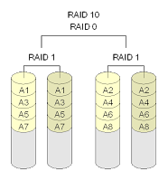

In class you created a RAID disk and an LVM Logical Volume. In this lab you will combine the two to implement RAID 10. Here's what a RAID 10 looks like:

You will implement RAID 1 using Linux's software RAID and then join your two RAID devices into a Volume Group. You will then create a logical volume that takes up all the space in the volume group.
SetupYou will need to install the following packages if you haven't already:
# apt-get install mdadm lvm2
Create a temporary directory for the results that you will submit at the end of the lab.
# mkdir /tmp/lab4
At the end of each step you will record your configuration with the following command:
# (df; cat /proc/mdstat; pvdisplay -c; vgdisplay -c; lvdisplay -c) > /tmp/lab4/stepN.log
IMPORTANT:Replace the 'N' with the number of the step you are on. For example if you have just completed step 2 your command looks like this:# (df; cat /proc/mdstat; pvdisplay -c; vgdisplay -c; lvdisplay -c) > /tmp/lab4/step2.log
Before you can begin you will need to create four files and bind four loopback devices to them.
# dd if=/dev/zero bs=1M count=10of=disk0.img# dd if=/dev/zero bs=1M count=10of=disk1.img# dd if=/dev/zero bs=1M count=10of=disk2.img# dd if=/dev/zero bs=1M count=10of=disk3.img# losetup /dev/loop0 disk0.img# losetup /dev/loop1 disk1.img# losetup /dev/loop2 disk2.img# losetup /dev/loop3 disk3.img
Now you are ready to begin.
Step 1: Create two RAID 1 DrivesFor this step you will create two RAID drives (/dev/md0 and /dev/md1). Use the book or Google to find the exact commands to create your RAID 1 devices. If you have done it correctly the contents of /proc/mdstat should look like this:
# cat /proc/mdstatPersonalities : [linear] [multipath] [raid0] [raid1] [raid6] [raid5] [raid4] [raid10]md1 : active raid1 loop3[1] loop2[0]   10176 blocks super 1.2 [2/2] [UU]  md0 : active raid1 loop1[1] loop0[0]   10176 blocks super 1.2 [2/2] [UU]  unused devices: <none>
When you are satisfied that you have created the two RAID devices save your progress as /tmp/lab4/step1.log using the command in the setup section.
Step 2: Use LVM to Make a Logical VolumeYour two RAID devices are each only 10MB in size. In this step you will use LVM to join them together into a roughly 20MB logical volume. Refer to the instructions in the book for help or use Google. The general procedure is:
  - Create a Physical Volume for each /dev/md0 and /dev/md1
  - Create a Volume Group and add both physical volumes to it
  - Create a Logical Volume in your VG and allocate all space (called extents) to it
  - Format your LV with the ext4 filesystem and mount it

Once you have completed the above steps you should should see output from lvdisplay similar to this:
# lvdisplayFile descriptor 3 (/usr/share/bash-completion/completions) leaked on lvdisplay invocation. Parent PID 4190: /bin/bash --- Logical volume --- LV Path        /dev/mygroup/lvol0 LV Name        lvol0 VG Name        mygroup LV UUID        WNLULd-kHhv-ZmNx-GyDB-CNt1-96RK-wIohXL LV Write Access    read/write LV Creation host, time chef, 2013-09-30 15:25:26 -0700 LV Status       available # open         1 LV Size        16.00 MiB Current LE       4 Segments        2 Allocation       inherit Read ahead sectors   auto - currently set to   256 Block device      252:1
The names will vary based on what you entered into the commands in steps 1 through 3. If you have completed this step correctly you should also see information regarding the mounted ext4 filesystem in the /proc/mounts file:
# cat /proc/mounts.../dev/mapper/mygroup-lvol0 /mnt ext4 rw,relatime,data=ordered 0 0
When you are satisfied that you have completed this step save your progress as /tmp/lab4/step2.log using the command in the setup section.
Step 3 (Extra Credit)Hot-add additional storage to your array. Do this by creating a third RAID 1 array on /dev/md2 and adding it to the logical volume you created in step 2. There are instructions for how to do this in the book and on Google. You will notice that after you add extents to your logical volume that the size of your ext4 filesystem doesn't change:
# df /mnt/dev/mapper/mygroup-lvol0   14839  140   13880  1% /mnt
You will need an additional command to resize the ext4 filesystem. Luckily you can do this while it's still mounted! That is a major enhancement over ext4's predecessors. Once you have enlarged the ext4 filesystem save your progress as /tmp/lab4/step3.log using the command in the setup section.
Turn InWhen you are all finished tar all of your log files using the following command:
# tar -zcvf lab4.tar.gz /tmp/lab4
Now submit your tar file on Blackboard.
Grading
  * 10 points step 1
  * 10 points step 2
  * 5 points extra credit (step 3)

