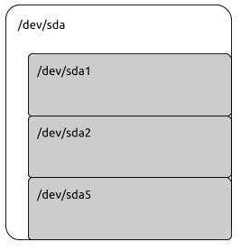

Fixed disks are subdivided into volumes called partitions. In this lesson you'll learn how to view and manage disk partitions.
The lecture slides can be found [here](https://docs.google.com/a/lifealgorithmic.com/presentation/d/18hAGUgC34TvlF586uTv4cLpNGVhwHwQgPxWhUnpNiNA/edit?usp=sharing).
Commands
  * parted

Configuration
  * none

Further Reading
  * [The GNU Parted User Manual](http://www.gnu.org/software/parted/manual/parted.html)

Related
  * [Adding Disks to your VM](http://www.lifealgorithmic.com/home/cis-191/adding_disks_to_your_vm)

## Introduction 

A partition is a region on a disk that appears as a separate block device. Linux's system disk often has multiple partitions to meet the requirements on a system disk:
  - A boot partition with a simple filesystem (like ext2) that GRUB can use
  - A swap partition used to extend physical memory
  - A system partition with an advanced filesystem (like ext4 or an LVM volume)

Partitioning disks to meet these requirements is the job of an administrator.

## Partitions and Block Devices 





There's an easy way to see the partitions on the system disk of your VM:

```
$ ls -la /dev/sda*
brw-rw---- 1 root disk 8, 0 Sep 17 16:01 /dev/sda
brw-rw---- 1 root disk 8, 1 Sep 17 16:01 /dev/sda1
brw-rw---- 1 root disk 8, 2 Sep 17 16:01 /dev/sda2
brw-rw---- 1 root disk 8, 5 Sep 17 16:01 /dev/sda5
```

Notice that there's a "base" disk /dev/sda and three "derived" disks (/dev/sda1, /dev/sda2 and /dev/sda3). They are all block devices and each of them can be separately formatted with a filesystem. The device /dev/sda represents the entire disk and the derived disks are partitions inside that disk. The picture shows a schematic of the relationship between the base disk and it's partitions.
If you were to format /dev/sda you would destroy the data on /dev/sda1, /dev/sda2 and /dev/sda5.

## Using Parted 

The parted command is used to view and manage partitions. The parted command has it's own command line with it's own commands. Remember to run parted as root. Some functionality will be disabled if you don't:

```
$ sudo parted /dev/sda
GNU Parted 2.3
Using /dev/sda
Welcome to GNU Parted! Type 'help' to view a list of commands.
(parted)                               
```

Run the "help" command to see parted's menu:

```
(parted) help
 align-check TYPE N            check partition N for TYPE(min|opt) alignment
 check NUMBER               do a simple check on the file system
 cp [FROM-DEVICE] FROM-NUMBER TO-NUMBER  copy file system to another partition
 help [COMMAND]              print general help, or help on COMMAND
 mklabel,mktable LABEL-TYPE        create a new disklabel (partition table)
 mkfs NUMBER FS-TYPE           make a FS-TYPE file system on partition NUMBER
 mkpart PART-TYPE [FS-TYPE] START END   make a partition
 mkpartfs PART-TYPE FS-TYPE START END   make a partition with a file system
 resizepart NUMBER END          resize partition NUMBER
 move NUMBER START END          move partition NUMBER
 name NUMBER NAME             name partition NUMBER as NAME
 print [devices|free|list,all|NUMBER]   display the partition table, available devices, free space, all found partitions, or a particular
    partition
 quit                   exit program
 rescue START END             rescue a lost partition near START and END
 resize NUMBER START END         resize partition NUMBER and its file system
 rm NUMBER                delete partition NUMBER
 select DEVICE              choose the device to edit
 set NUMBER FLAG STATE          change the FLAG on partition NUMBER
 toggle [NUMBER [FLAG]]          toggle the state of FLAG on partition NUMBER
 unit UNIT                set the default unit to UNIT
 version                 display the version number and copyright information of GNU Parted
```

You can view your existing partitions with the command:

```
(parted) print
Model: VMware Virtual disk (scsi)
Disk /dev/sda: 34.4GB
Sector size (logical/physical): 512B/512B
Partition Table: msdos
Number Start  End   Size  Type   File system Flags
1   1049kB 256MB  255MB  primary  ext2     boot
2   257MB  34.4GB 34.1GB extended
5   257MB  34.4GB 34.1GB logical        lvm
```

## Creating a Partition Table 

If you have followed the steps in[Adding Disks to your VM](http://www.lifealgorithmic.com/home/cis-191/adding_disks_to_your_vm)then you should have two additional disks (/dev/sdb and /dev/sdc). Initially they will be blank:

```
student@ubuntu:~$ sudo parted /dev/sdb
[sudo] password for student:
GNU Parted 2.3
Using /dev/sdb
Welcome to GNU Parted! Type 'help' to view a list of commands.
(parted) print
Error: /dev/sdb: unrecognised disk label                 
```

The mklabel command makes a partition table. We'll make a GPT (GUID Partition Table) label. GPT is a newer label type that supports disks that are greater than 2TB. The old type MSDOS is used by default for compatibility, but even Windows has switched over.

```
(parted) mklabel gpt
(parted) print free                                                       
Model: VMware Virtual disk (scsi)
Disk /dev/sdb: 21.5GB
Sector size (logical/physical): 512B/512B
Partition Table: gpt
Number  Start   End     Size    File system  Name  Flags
        17.4kB  21.5GB  21.5GB  Free Space
```

## Creating Partitions 

Now we can partition the disk. Let's create two partitions of roughly 10GB each:

```
(parted) mkpart                             
Partition name? []? Part1
File system type? [ext2]? ext4                     
Start? 1MB
End? 10GB
```

Notice that the partition starts at the 1MB mark. This is for performance reasons. Try creating a partition that starts at zero. Where does it really start? Now let's make a swap partition:

```
(parted) mkpart                             
Partition name? []? Part2
File system type? [ext2]? linux-swap                  
Start? 10GB                               
End? 20GB
```

Now we have two partitions, let's see what we've done:

```
(parted) print free
Model: VMware Virtual disk (scsi)
Disk /dev/sdb: 21.5GB
Sector size (logical/physical): 512B/512B
Partition Table: gpt
Number Start  End   Size  File system Name  Flags
    17.4kB 1049kB 1031kB Free Space
1   1049kB 10.0GB 9999MB        Part1
2   10.0GB 20.0GB 9999MB        Part2
    20.0GB 21.5GB 1475MB Free Space
```

It looks like we've left a bit of space, let's leave it for now. So far we haven't changed anything on the disk. Partitioning is dangerous, therefore parted doesn't do anything permanent until we exit. Let's exit and have parted write the changes to the disk:

```
(parted) quit
```

Now let's look to see if the new partitions are available:

```
$ ls -ls /dev/sdb*
0 brw-rw---- 1 root disk 8, 16 Oct 1 11:47 /dev/sdb
0 brw-rw---- 1 root disk 8, 17 Oct 1 11:45 /dev/sdb1
0 brw-rw---- 1 root disk 8, 18 Oct 1 11:47 /dev/sdb2
```

## Using Partitions 

In order for the partitions we just created to be usable they need to be formatted and mounted. More information on that can be found in[Files, Filesystems and Block Devices](http://www.lifealgorithmic.com/home/cis-191/files_filesystems_and_block_devices)and[Filesystems and Mount](http://www.lifealgorithmic.com/home/cis-191/filesystems_and_mount).
