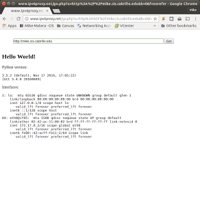

In this lesson you'll create a simple web application from scratch and "containerize" it. Lecture slides are [here](https://docs.google.com/presentation/d/1AesHs7txbJ0W6lhle0WuCFpDnkrm9Sgv4szmLKFV6aQ/edit?usp=sharing).

### Commands 

  * docker

### Configuration 

  * Dockerfile

### Further Reading 

  * [Installing Docker on Ubuntu](https://docs.docker.com/engine/installation/linux/ubuntu/)
  * [Docker post-installation steps](https://docs.docker.com/engine/installation/linux/linux-postinstall/) (so you can use Docker as a non-root user)
  * [Docker Tutorial using Flask](http://containertutorials.com/docker-compose/flask_simple_app.html)
  * [Docker and IPv6](https://docs.docker.com/engine/userguide/networking/default_network/ipv6/)

## Introduction 

Containers let you take a simple network program and easily make it a service. Containerizing, as it's called, has the benefit that your service is portable (it can move easily from one host or platform to another). Containerization also confers a security benefit because your service is isolated from the host machine. In this lesson you'll create a simple web service using the Python programming language. Then you'll create a Dockerfile to containerize the service. Also, you'll learn about the life cycle of containers, how they use storage and how to manage the storage they use.

## Network Setup 

Before you can have a service you must configure your firewall and DNS so that:

  - Your app server has a DNS record (preferably www.yourdomain.cis.cabrillo.edu)
  - You allow HTTP traffic from the internet to your app server.

If you have done that already, great. If not follow these instructions.

### Firewall Rule 

On your router you must setup a forwarding rule. The rule must allow new connections coming from the internet destined for TCP/80 to be forwarded to your web server. Make sure you alter the following command to reflect the IPv6 address of your webserver:

```
router$ sudo ip6tables -I FORWARD 1 -m state --state NEW -p tcp -d app-server-ipv6-addr --dport 80 -j ACCEPT
```

With the firewall rule established you will be able to connect to your web server with your browser if you're on the CIS network or you have IPv6 at home. When you put an IPv6 address into the browser you need to use square brackets. Like this:

``` 
http://[ipv6-address-goes-inside-of-brackets]/
```

If you don't have IPv6 and you want to test your connection you can use an IPv6 proxy site:

  * [http://www.ipv6proxy.net/](http://www.ipv6proxy.net/)
  * [http://ipv6proxy.org/](http://ipv6proxy.org/)

Those sites let you type in an IPv6 address and they will load the page for you.
  WARNING: DO NOT USE IPv6 PROXIES FOR ANY PERSONAL BROWSING.THEY ARE INSECURE.
Typing your IPv6 address every time is a pain. Next you will setup an name for your server in DNS. Don't forget to save your firewall rules!

### Setup DNS 

Having a DNS record that points to your server makes life much easier. You only need to setup an IPv6 (AAAA) address because your IPv4 address isn't useful (even for the CIS network). In your domain file add a record like the following. Be sure to replace the IPv6 address in my example with the address of your server:

```
www IN AAAA app-server-ipv6-address
```

Be sure to update your serial number! Reload your DNS configuration with the command:

```
router$ sudo systemctl restart bind9
```

Test that your record works with dig:

```
router$ dig AAAA www.mydomain.cis.cabrillo.edu @localhost
```

If you get an answer you should now be able to browse to your webserver directly:

```
  http://www.mydomain.cis.cabrillo.edu/
```

But what about the "naked" domain? Most of time we go to "amazon.com" not "www.amazon.com." The concept of a "naked" domain is a problem for DNS. The way domains handle it is against the standard, but it's so common now that it just works everywhere. To make entering the domain address reach the webserver you must add the following record.

```
@ IN AAAA <your-app-server-ipv6-address>
```

After reloading your DNSconfiguration(with the updated serial number) you should be able to access your web server this way:

```
  http://mydomain.cis.cabrillo.edu/
```

You're now on the Internet for real.

## Your First Service 

The Python programming language makes it easy to run so-called microservices. Those are simple web applications that fulfill a single purpose. For example, you could write a microservice that lets you add and remove users to a host remotely. Microservices are popular in part because they're easy to write and deploy in containers. To start your microservice create a directory from the student user's home directory:

```
$ mkdir ~/HelloService
$ cd ~/HelloService
```

Now copy the code from this Python file into the directory:

```
from flask import Flask
import subprocess
import sys
app = Flask(__name__)
@app.route('/')
def hello_world():
  #ifconfig = subprocess.check_output(['ifconfig', '-a']).decode('UTF-8')
  html = '<html><h2>Hello World!</h2>'
  html += '<p>Python version:</p>'
  html += '<pre>' + str(sys.version) + '</pre>'
  html += '<p>Interfaces:</p>'
  html += '<pre>' + subprocess.check_output(['ip', 'addr']).decode('UTF-8') + '</pre>'
  html += '</html>'
  return html
if __name__ == '__main__':
  app.run(debug=True,host='0.0.0.0',port=5000)
```

Now try to run your service on your VM. You'll get an error:

```
app-server$ python3 ./app.py
Traceback (most recent call last):
 File "./app.py", line 1, in <module>
  from flask import Flask
ImportError: No module named 'flask'
```

The flask library is not installed! You can't install it with apt-get but you can install it using Python's package manager pip. Do that with the following commands:

```
app-server$ sudo apt-get install python3-pip
app-server$ pip3 install flask
```

Notice you don't have to use sudo to install flask. That installs it for the current user only (which is nice for development libraries). Now try to start your application and you'll see it come to life:

```
app-server$ python3 ./app.py
* Running on http://0.0.0.0:5000/ (Press CTRL+C to quit)
* Restarting with stat
* Debugger is active!
* Debugger PIN: 152-738-927
```

The service runs in the foreground, to stop it hit Ctrl-C on the keyboard. The service listens for connections on port 5000 so that it can be started by a normal user. For now, verify that your service is running using netstat in a second shell:

```
$ sudo netstat -lntp
Active Internet connections (only servers)
Proto Recv-Q Send-Q Local Address      Foreign Address     State    PID/Program name
tcp    0   0 0.0.0.0:5000      0.0.0.0:*        LISTEN   19635/python3 
tcp    0   0 0.0.0.0:22       0.0.0.0:*        LISTEN   1380/sshd   
tcp6    0   0 :::22          :::*          LISTEN   1380/sshd   
```

You should see python3 listening on port 5000. We'll move that to port 80 as a part of the containerization.

## Containerization and Dockerfile 

Now let's move your service into a container. The first step is to create a Dockerfile. In the same directory as app.py create a file called Dockerfile and place the following contents in it:

```
FROM ubuntu:latest
MAINTAINER You "you@you.cis.cabrillo.edu"
RUN apt-get update -y
RUN apt-get install -y python3-pip python3-dev build-essential
RUN pip3 install flask
COPY . /app
WORKDIR /app
ENTRYPOINT ["python3"]
CMD ["app.py"]
```

Change the MAINTAINER line to have your name and email address. Now build your container with the following command:

```
app-server$ docker build -t hello-service:latest .
```

Your container will take a little while to build. Notice what's happening:
  - The container starts with the base Ubuntu image. If you followed last week's instructions you should have it downloaded already. If not it will download automatically.
  - The RUN commands are executed when you build a container. They:

  - run apt-get to fetch pip, just like you did on your VM
  - run pip3 to install flask, just like you did on your VM

  - Copy the contents of the current directory into your container.

The process will take a while. Rerun the command. It takes almost no time. That's because Docker makes a snapshot of your container after each RUN command. When you rebuild the container it uses the cached snapshots so that apt-get and pip3 do not have to be rerun! 

### Starting and Stopping Your Container 

Now you have a built container. The image will be ready to deploy. You can see the built images with the command:

```
app-server$ docker image ls
REPOSITORY     TAG         IMAGE ID      CREATED       SIZE
hello-service    latest       499c048de925    11 seconds ago   445 MB
<none>       <none>       60d0160c806e    8 minutes ago    450 MB
<none>       <none>       7e7bd60d80a3    9 minutes ago    445 MB
ubuntu       latest       6a2f32de169d    10 days ago     117 MB
mysql        latest       d5127813070b    11 days ago     407 MB
hello-world     latest       48b5124b2768    3 months ago    1.84 kB
docker/whalesay   latest       6b362a9f73eb    23 months ago    247 MB
```

The image can be deployed as many times as you like. Each time you deploy an image you give the running container a name. Also, Docker creates a virtual network for containers and manages port forwarding automatically when you specify the -p option. Start an instance of your container by using the docker run command:

```
app-server$ docker run --name hello-instance -p 80:5000 hello-service:latest
```

Here's what the options do:

  * --name gives your instance a name. If you don't specify a name one will be automatically assigned, like "semiotic-abbey"\
  * -p 80:5000 tells docker to proxy connections on the local port 80 to the container's port 5000
  * hello-service:latest is the container image to launch.

Examining netstat you should see that docker-proxy is running on port 80:

```
app-server$ sudo netstat -lntp
Active Internet connections (only servers)
Proto Recv-Q Send-Q Local Address      Foreign Address     State    PID/Program name
tcp    0   0 0.0.0.0:22       0.0.0.0:*        LISTEN   1380/sshd   
tcp6    0   0 :::80          :::*          LISTEN   1223/docker-proxy
tcp6    0   0 :::22          :::*          LISTEN   1380/sshd
```

Test that you can see the hello app from your browser. Remember, if you don't have IPv6 at home you'll need to use a proxy service as shown above. Here's a screenshot of connecting to my hello-app from home:





Congratulations you now have a running microservice!

## Management and Cleanup 

Docker run creates a new instance and starts it. If you specify the -d option to docker run the container is run in the background and the prompt comes right back. This is usually how services will be run. While your service is running run this command in a separate shell:

```
app-server$ docker ps
CONTAINER ID    IMAGE         COMMAND       CREATED       STATUS       PORTS         NAMES
57d9261992ef    hello-service:latest  "python3 app.py"  23 minutes ago   Up 14 minutes    0.0.0.0:80->5000/tcp  hello-instance
```

You can see the instance running. If you use Control-C to stop the service it will no longer appear until you give docker ps the -a argument:

```
$ docker ps -a
CONTAINER ID    IMAGE         COMMAND       CREATED       STATUS           PORTS        NAMES
57d9261992ef    hello-service:latest  "python3 app.py"  24 minutes ago   Exited (0) 4 seconds ago            hello-instance
```

Notice a stopped instance has no ports. You can restart the instance with the command:

```
app-server$ docker start hello-instance
```

That will run the service in the background. You can stop it with:

```
app-server$ docker stop hello-instance
```

If you change the Dockerfile or you want to change the program in app.py you must rebuild the container image using docker build. Your instance is not automatically updated. To get the new source you have to delete your instance with docker rm and re-run it using docker run.